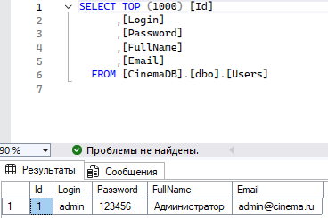
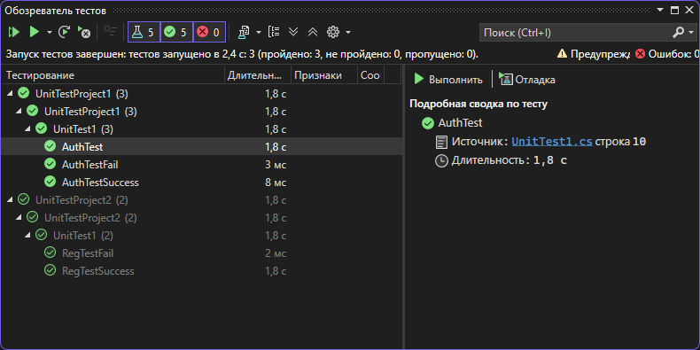

# Практическая работа №6 часть 3

**Разработчики:** Солдатов, Дудченко  
**Группа:** 123  
**Преподаватель:** ТГАксенова

---
## Цель работы

Провести тестирование разработанных программных модулей с использованием средств автоматизации Microsoft Visual Studio методом "белого ящика".

## Вывод о проведённом тестировании

**Все 5 модульных тестов выполнены успешно (100% успеха).** Это подтверждает корректность работы окон авторизации и регистрации и правильность проведённого рефакторинга кода.

## sql-скрипт базы данных 
USE [master]
GO
/****** Object:  Database [CinemaDB]    Script Date: 27.03.2026 1:15:53 ******/
CREATE DATABASE [CinemaDB]
 CONTAINMENT = NONE
 ON  PRIMARY 
( NAME = N'CinemaDB', FILENAME = N'C:\Program Files\Microsoft SQL Server\MSSQL16.SQLEXPRESS\MSSQL\DATA\CinemaDB.mdf' , SIZE = 8192KB , MAXSIZE = UNLIMITED, FILEGROWTH = 65536KB )
 LOG ON 
( NAME = N'CinemaDB_log', FILENAME = N'C:\Program Files\Microsoft SQL Server\MSSQL16.SQLEXPRESS\MSSQL\DATA\CinemaDB_log.ldf' , SIZE = 8192KB , MAXSIZE = 2048GB , FILEGROWTH = 65536KB )
 WITH CATALOG_COLLATION = DATABASE_DEFAULT, LEDGER = OFF
GO
ALTER DATABASE [CinemaDB] SET COMPATIBILITY_LEVEL = 160
GO
IF (1 = FULLTEXTSERVICEPROPERTY('IsFullTextInstalled'))
begin
EXEC [CinemaDB].[dbo].[sp_fulltext_database] @action = 'enable'
end
GO
ALTER DATABASE [CinemaDB] SET ANSI_NULL_DEFAULT OFF 
GO
ALTER DATABASE [CinemaDB] SET ANSI_NULLS OFF 
GO
ALTER DATABASE [CinemaDB] SET ANSI_PADDING OFF 
GO
ALTER DATABASE [CinemaDB] SET ANSI_WARNINGS OFF 
GO
ALTER DATABASE [CinemaDB] SET ARITHABORT OFF 
GO
ALTER DATABASE [CinemaDB] SET AUTO_CLOSE ON 
GO
ALTER DATABASE [CinemaDB] SET AUTO_SHRINK OFF 
GO
ALTER DATABASE [CinemaDB] SET AUTO_UPDATE_STATISTICS ON 
GO
ALTER DATABASE [CinemaDB] SET CURSOR_CLOSE_ON_COMMIT OFF 
GO
ALTER DATABASE [CinemaDB] SET CURSOR_DEFAULT  GLOBAL 
GO
ALTER DATABASE [CinemaDB] SET CONCAT_NULL_YIELDS_NULL OFF 
GO
ALTER DATABASE [CinemaDB] SET NUMERIC_ROUNDABORT OFF 
GO
ALTER DATABASE [CinemaDB] SET QUOTED_IDENTIFIER OFF 
GO
ALTER DATABASE [CinemaDB] SET RECURSIVE_TRIGGERS OFF 
GO
ALTER DATABASE [CinemaDB] SET  ENABLE_BROKER 
GO
ALTER DATABASE [CinemaDB] SET AUTO_UPDATE_STATISTICS_ASYNC OFF 
GO
ALTER DATABASE [CinemaDB] SET DATE_CORRELATION_OPTIMIZATION OFF 
GO
ALTER DATABASE [CinemaDB] SET TRUSTWORTHY OFF 
GO
ALTER DATABASE [CinemaDB] SET ALLOW_SNAPSHOT_ISOLATION OFF 
GO
ALTER DATABASE [CinemaDB] SET PARAMETERIZATION SIMPLE 
GO
ALTER DATABASE [CinemaDB] SET READ_COMMITTED_SNAPSHOT OFF 
GO
ALTER DATABASE [CinemaDB] SET HONOR_BROKER_PRIORITY OFF 
GO
ALTER DATABASE [CinemaDB] SET RECOVERY SIMPLE 
GO
ALTER DATABASE [CinemaDB] SET  MULTI_USER 
GO
ALTER DATABASE [CinemaDB] SET PAGE_VERIFY CHECKSUM  
GO
ALTER DATABASE [CinemaDB] SET DB_CHAINING OFF 
GO
ALTER DATABASE [CinemaDB] SET FILESTREAM( NON_TRANSACTED_ACCESS = OFF ) 
GO
ALTER DATABASE [CinemaDB] SET TARGET_RECOVERY_TIME = 60 SECONDS 
GO
ALTER DATABASE [CinemaDB] SET DELAYED_DURABILITY = DISABLED 
GO
ALTER DATABASE [CinemaDB] SET ACCELERATED_DATABASE_RECOVERY = OFF  
GO
ALTER DATABASE [CinemaDB] SET QUERY_STORE = ON
GO
ALTER DATABASE [CinemaDB] SET QUERY_STORE (OPERATION_MODE = READ_WRITE, CLEANUP_POLICY = (STALE_QUERY_THRESHOLD_DAYS = 30), DATA_FLUSH_INTERVAL_SECONDS = 900, INTERVAL_LENGTH_MINUTES = 60, MAX_STORAGE_SIZE_MB = 1000, QUERY_CAPTURE_MODE = AUTO, SIZE_BASED_CLEANUP_MODE = AUTO, MAX_PLANS_PER_QUERY = 200, WAIT_STATS_CAPTURE_MODE = ON)
GO
USE [CinemaDB]
GO
/****** Object:  Table [dbo].[Genres]    Script Date: 27.03.2026 1:15:53 ******/
SET ANSI_NULLS ON
GO
SET QUOTED_IDENTIFIER ON
GO
CREATE TABLE [dbo].[Genres](
	[Id] [int] IDENTITY(1,1) NOT NULL,
	[Name] [nvarchar](100) NOT NULL,
PRIMARY KEY CLUSTERED 
(
	[Id] ASC
)WITH (PAD_INDEX = OFF, STATISTICS_NORECOMPUTE = OFF, IGNORE_DUP_KEY = OFF, ALLOW_ROW_LOCKS = ON, ALLOW_PAGE_LOCKS = ON, OPTIMIZE_FOR_SEQUENTIAL_KEY = OFF) ON [PRIMARY]
) ON [PRIMARY]
GO
/****** Object:  Table [dbo].[Halls]    Script Date: 27.03.2026 1:15:53 ******/
SET ANSI_NULLS ON
GO
SET QUOTED_IDENTIFIER ON
GO
CREATE TABLE [dbo].[Halls](
	[Id] [int] IDENTITY(1,1) NOT NULL,
	[Name] [nvarchar](100) NOT NULL,
	[Classification] [nvarchar](100) NULL,
	[Rows] [int] NOT NULL,
	[SeatsPerRow] [int] NOT NULL,
PRIMARY KEY CLUSTERED 
(
	[Id] ASC
)WITH (PAD_INDEX = OFF, STATISTICS_NORECOMPUTE = OFF, IGNORE_DUP_KEY = OFF, ALLOW_ROW_LOCKS = ON, ALLOW_PAGE_LOCKS = ON, OPTIMIZE_FOR_SEQUENTIAL_KEY = OFF) ON [PRIMARY]
) ON [PRIMARY]
GO
/****** Object:  Table [dbo].[MovieGenres]    Script Date: 27.03.2026 1:15:53 ******/
SET ANSI_NULLS ON
GO
SET QUOTED_IDENTIFIER ON
GO
CREATE TABLE [dbo].[MovieGenres](
	[MovieId] [int] NOT NULL,
	[GenreId] [int] NOT NULL,
PRIMARY KEY CLUSTERED 
(
	[MovieId] ASC,
	[GenreId] ASC
)WITH (PAD_INDEX = OFF, STATISTICS_NORECOMPUTE = OFF, IGNORE_DUP_KEY = OFF, ALLOW_ROW_LOCKS = ON, ALLOW_PAGE_LOCKS = ON, OPTIMIZE_FOR_SEQUENTIAL_KEY = OFF) ON [PRIMARY]
) ON [PRIMARY]
GO
/****** Object:  Table [dbo].[Movies]    Script Date: 27.03.2026 1:15:53 ******/
SET ANSI_NULLS ON
GO
SET QUOTED_IDENTIFIER ON
GO
CREATE TABLE [dbo].[Movies](
	[Id] [int] IDENTITY(1,1) NOT NULL,
	[Title] [nvarchar](200) NOT NULL,
	[Description] [nvarchar](max) NULL,
	[Rating] [decimal](3, 1) NULL,
	[StartDate] [date] NULL,
	[AgeRating] [nvarchar](10) NULL,
	[CoverImage] [nvarchar](500) NULL,
PRIMARY KEY CLUSTERED 
(
	[Id] ASC
)WITH (PAD_INDEX = OFF, STATISTICS_NORECOMPUTE = OFF, IGNORE_DUP_KEY = OFF, ALLOW_ROW_LOCKS = ON, ALLOW_PAGE_LOCKS = ON, OPTIMIZE_FOR_SEQUENTIAL_KEY = OFF) ON [PRIMARY]
) ON [PRIMARY] TEXTIMAGE_ON [PRIMARY]
GO
/****** Object:  Table [dbo].[Sessions]    Script Date: 27.03.2026 1:15:53 ******/
SET ANSI_NULLS ON
GO
SET QUOTED_IDENTIFIER ON
GO
CREATE TABLE [dbo].[Sessions](
	[Id] [int] IDENTITY(1,1) NOT NULL,
	[MovieId] [int] NOT NULL,
	[HallId] [int] NOT NULL,
	[SessionDate] [date] NOT NULL,
	[SessionTime] [time](7) NOT NULL,
	[Price] [decimal](10, 2) NOT NULL,
PRIMARY KEY CLUSTERED 
(
	[Id] ASC
)WITH (PAD_INDEX = OFF, STATISTICS_NORECOMPUTE = OFF, IGNORE_DUP_KEY = OFF, ALLOW_ROW_LOCKS = ON, ALLOW_PAGE_LOCKS = ON, OPTIMIZE_FOR_SEQUENTIAL_KEY = OFF) ON [PRIMARY]
) ON [PRIMARY]
GO
/****** Object:  Table [dbo].[Tickets]    Script Date: 27.03.2026 1:15:53 ******/
SET ANSI_NULLS ON
GO
SET QUOTED_IDENTIFIER ON
GO
CREATE TABLE [dbo].[Tickets](
	[Id] [int] IDENTITY(1,1) NOT NULL,
	[UserId] [int] NOT NULL,
	[SessionId] [int] NOT NULL,
	[SeatRow] [int] NOT NULL,
	[SeatNumber] [int] NOT NULL,
	[PurchaseDate] [datetime] NULL,
PRIMARY KEY CLUSTERED 
(
	[Id] ASC
)WITH (PAD_INDEX = OFF, STATISTICS_NORECOMPUTE = OFF, IGNORE_DUP_KEY = OFF, ALLOW_ROW_LOCKS = ON, ALLOW_PAGE_LOCKS = ON, OPTIMIZE_FOR_SEQUENTIAL_KEY = OFF) ON [PRIMARY]
) ON [PRIMARY]
GO
/****** Object:  Table [dbo].[Users]    Script Date: 27.03.2026 1:15:53 ******/
SET ANSI_NULLS ON
GO
SET QUOTED_IDENTIFIER ON
GO
CREATE TABLE [dbo].[Users](
	[Id] [int] IDENTITY(1,1) NOT NULL,
	[Login] [nvarchar](100) NOT NULL,
	[Password] [nvarchar](256) NOT NULL,
	[FullName] [nvarchar](200) NULL,
	[Email] [nvarchar](200) NULL,
PRIMARY KEY CLUSTERED 
(
	[Id] ASC
)WITH (PAD_INDEX = OFF, STATISTICS_NORECOMPUTE = OFF, IGNORE_DUP_KEY = OFF, ALLOW_ROW_LOCKS = ON, ALLOW_PAGE_LOCKS = ON, OPTIMIZE_FOR_SEQUENTIAL_KEY = OFF) ON [PRIMARY],
UNIQUE NONCLUSTERED 
(
	[Login] ASC
)WITH (PAD_INDEX = OFF, STATISTICS_NORECOMPUTE = OFF, IGNORE_DUP_KEY = OFF, ALLOW_ROW_LOCKS = ON, ALLOW_PAGE_LOCKS = ON, OPTIMIZE_FOR_SEQUENTIAL_KEY = OFF) ON [PRIMARY]
) ON [PRIMARY]
GO
ALTER TABLE [dbo].[Halls] ADD  DEFAULT ((10)) FOR [Rows]
GO
ALTER TABLE [dbo].[Halls] ADD  DEFAULT ((10)) FOR [SeatsPerRow]
GO
ALTER TABLE [dbo].[Movies] ADD  DEFAULT ((0)) FOR [Rating]
GO
ALTER TABLE [dbo].[Sessions] ADD  DEFAULT ((300)) FOR [Price]
GO
ALTER TABLE [dbo].[Tickets] ADD  DEFAULT (getdate()) FOR [PurchaseDate]
GO
ALTER TABLE [dbo].[MovieGenres]  WITH CHECK ADD FOREIGN KEY([GenreId])
REFERENCES [dbo].[Genres] ([Id])
ON DELETE CASCADE
GO
ALTER TABLE [dbo].[MovieGenres]  WITH CHECK ADD FOREIGN KEY([MovieId])
REFERENCES [dbo].[Movies] ([Id])
ON DELETE CASCADE
GO
ALTER TABLE [dbo].[Sessions]  WITH CHECK ADD FOREIGN KEY([HallId])
REFERENCES [dbo].[Halls] ([Id])
GO
ALTER TABLE [dbo].[Sessions]  WITH CHECK ADD FOREIGN KEY([MovieId])
REFERENCES [dbo].[Movies] ([Id])
GO
ALTER TABLE [dbo].[Tickets]  WITH CHECK ADD FOREIGN KEY([SessionId])
REFERENCES [dbo].[Sessions] ([Id])
GO
ALTER TABLE [dbo].[Tickets]  WITH CHECK ADD FOREIGN KEY([UserId])
REFERENCES [dbo].[Users] ([Id])
GO
USE [master]
GO
ALTER DATABASE [CinemaDB] SET  READ_WRITE 
GO
